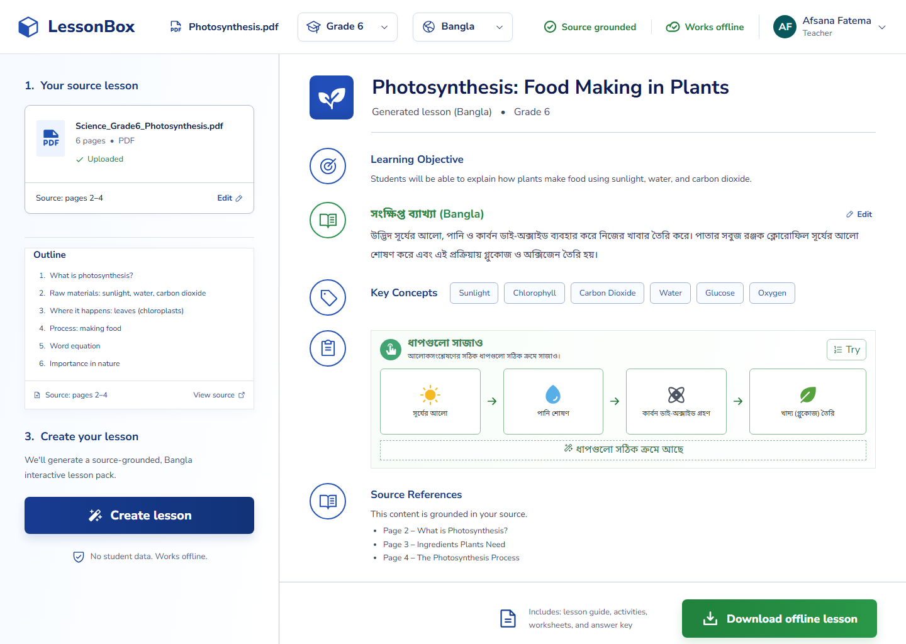

# LessonBox

**Turn one teacher PDF into a source-grounded, multilingual lesson pack that works without the internet.**



## The problem

Teachers in low-connectivity classrooms often have useful curriculum PDFs but not the time, tools, or reliable internet needed to turn them into engaging lessons in students' home languages. Generic AI chat tools can help, but their output is difficult to verify, may not cite the source, and usually assumes an always-online classroom.

## The solution

LessonBox is a teacher-first workspace for converting selected pages from a lesson PDF into a classroom-ready learning pack. The experience is designed around four promises:

- **Source grounded:** every lesson section points back to the source pages.
- **Multilingual:** the prototype demonstrates a Grade 6 science lesson in Bangla.
- **Interactive:** students can practice concepts through simple activities.
- **Offline first:** teachers can download a self-contained HTML lesson that runs without internet access.

## What works in this prototype

- Replace the sample PDF and update the source filename.
- Choose grade and language settings.
- Generate and review a lesson experience.
- Edit the Bangla explanation.
- Open source references.
- Try the photosynthesis sequencing activity.
- Download a real, self-contained offline HTML lesson.
- Use the responsive teacher workspace on desktop or mobile.

> **Prototype scope:** the current public build demonstrates the complete product journey and offline export. Lesson generation and source-grounding data are simulated for the sample lesson; a production version would connect PDF extraction and the OpenAI API to generate and verify content dynamically.

## Why it matters

LessonBox helps one teacher reuse the materials they already trust, teach in the language students understand, and bring interactive learning to classrooms where connectivity cannot be assumed. It is especially relevant to public schools and community learning environments across Bangladesh and other multilingual, bandwidth-constrained regions.

## Built with

- React 19
- Vite 6
- Phosphor Icons
- Responsive CSS
- Browser-native Blob export for offline lessons
- Codex for product design, implementation, testing, and iteration

## Run locally

```bash
npm install
npm run dev
```

Create a production build with:

```bash
npm run build
```

## Five-day MVP roadmap

1. **Experience foundation:** teacher workflow and responsive lesson preview.
2. **Document intelligence:** PDF text extraction, page selection, and citations.
3. **Lesson generation:** structured OpenAI output for objectives, explanations, activities, and answer keys.
4. **Offline delivery:** downloadable lesson bundle, quality checks, and classroom testing.
5. **Demo polish:** one reliable end-to-end story, accessibility review, video, and submission.

## Next steps

- Connect PDF parsing and the OpenAI Responses API.
- Add citation-level claim verification and confidence indicators.
- Generate printable worksheets and answer keys.
- Add more local languages and curriculum templates.
- Test with teachers in low-connectivity classrooms.

## Build Week

Created for the OpenAI Codex Build Week 2026 Education track.

